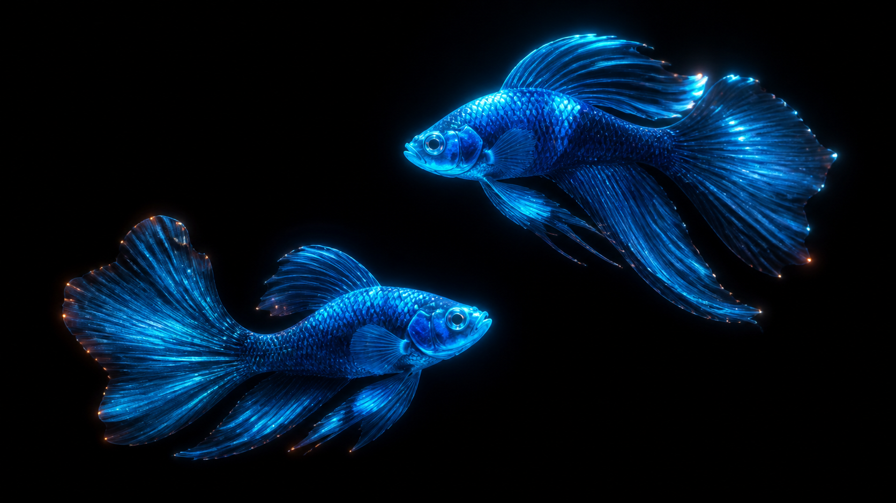
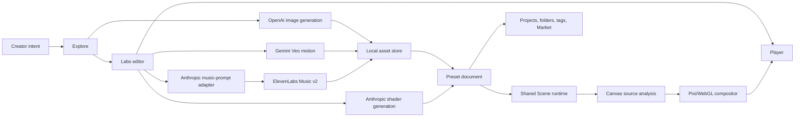
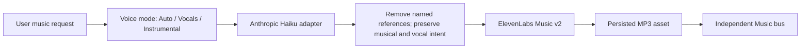

# Vibe Curator

### An AI-native creative environment for turning an idea, image, or video into a living audiovisual world.

**Live app:** <https://vibe-curator-production.up.railway.app>

## Beta release status

| Surface | Current beta | Distribution |
|---|---|---|
| Web and API | `0.1.1` live | [Railway production](https://vibe-curator-production.up.railway.app) |
| Chrome extension | `0.1.1` published | [Chrome Web Store](https://chromewebstore.google.com/detail/vibe-curator/niamjnjkmfnlpcejieffodipboacfdnm) |
| macOS app | next technical tester: `0.1.1-beta.4`, Apple silicon | [GitHub Releases](https://github.com/shubhamjoshipromail-svg/vibe-curator/releases) |

The web beta and extension are public. The macOS DMG is an ad-hoc-signed,
unnotarized technical-tester build: Gatekeeper blocks a normal first launch, so
the release page documents Finder **Open** / System Settings **Open Anyway**.
Developer ID signing and Apple notarization remain required before presenting
the native app as a frictionless general-public download.

Vibe Curator is an experimental desktop-first product that sits between a generative media studio, an ambient player, and a creator marketplace. A user describes a world—or brings an image or video—then shapes its motion, visual treatment, atmosphere, and soundtrack without losing editability after generation.

The thesis is simple:

> Generative media should not end as a static file. It should become a reusable, editable environment that can live on your screen.

This repository contains a working multi-model generative media studio—not merely a renderer mockup. It generates source images with OpenAI, generates original music with ElevenLabs, generates custom visual effects with Anthropic, and includes a wired image-to-video pipeline through Gemini Veo. Generated and uploaded media then enter the same editable source-aware renderer, persistent project library, curated Market, and full-screen Player.

## Generated media already created in the working prototype

The current local library contains real outputs created through the product pipeline:

- **37 saved projects** across generated, uploaded, procedural, and renderer-based scenes;
- **8 OpenAI GPT Image 2 source images** at 1536×1024;
- **11 saved ElevenLabs Music v2 tracks** stored as reusable MP3 assets;
- **2 user-uploaded source images** processed through the same visual system;
- **9 procedural source scenes** and **7 layered renderer scenes**;
- **7 built-in live GLSL effects**, plus saved generated and remixed effects;
- **3 source-aware treatment families**: tracked color grids, motion cells, and edge echoes;
- **19 seeded starting/Market cards** across living nature, electro-nature, psychedelic, atmospheric, and dark-fantasy directions.

The video-generation path is implemented end to end: a source image can be sent to Gemini Veo for an eight-second 720p motion draft, persisted as a video scene, looped, tracked, treated, and saved in Labs. The configured account has not yet produced a stored Veo asset because its video quota was unavailable; that is a provider-account limitation, not a missing product pipeline.

Generated binaries stay in the gitignored local `.vibe-data` store because they include large media and private iteration history. The public repository contains the complete generation, persistence, editing, and playback code plus safe public fixtures and benchmark assets.



## Why this project exists

Most generative products produce an artifact, download it, and end the relationship. Vibe Curator treats generation as the beginning of an authored system:

- the source visual remains replaceable;
- motion and treatments remain adjustable;
- shaders remain parameterized and remixable;
- ambience and music remain independent layers;
- the result can evolve over a session instead of repeating forever;
- a saved project can become a template for another creator.

The long-term product is a native creative surface where someone can say:

> “Make a dark bioluminescent koi world, rebuild the fish as tracked neon cells, make it react to fast psychedelic rap, and let it live behind my desktop.”

The application should translate that intent into an editable scene graph—not flatten it into an opaque video.

## Product experience

The product is organized around three connected surfaces:

### Explore

The creation and library surface.

- Generate a low-cost source image from a text prompt with OpenAI GPT Image.
- Upload an existing image as the creative starting point.
- Choose a plain-language starting look: Cinematic image, Neon glow, Printed dots, or Text mosaic.
- Switch in place between personal Projects and the Market.
- Browse projects through mutually exclusive automatic shelves: Generated visuals, Images & video, Living scenes, Music attached, and Remixes.
- Create one-level project folders; projects enter them only when the user explicitly assigns them.
- Search and filter with automatic tags without creating duplicate project cards.

### Labs

The non-destructive editor.

- Replace the underlying source with an image or looping video.
- Animate a still source into a short video through Gemini Veo when configured.
- Add deterministic source-aware treatments such as Motion cells, Edge echo, and Tracked grid.
- Adjust cell size, trail length, density, response, source visibility, tint, and glow.
- Stack built-in or AI-generated atmospheric shaders.
- Tune the scene through human controls—Mood, Motion, Depth, Glow, Atmosphere, and Intensity—instead of exposing rendering jargon.
- Select Light, Automatic, or Full runtime budgets without changing the saved creative intent.
- Generate and persist a 90-second ElevenLabs Music v2 track.
- Choose Auto, Vocals, or Instrumental. Vocal directions such as fast rap, singing style, language, cadence, and original lyrics survive prompt adaptation.
- Save explicitly; opening a built-in or Market card never silently adds another project.

### Player

The finished environment.

- Full-quality, full-screen playback at the display-oriented runtime budget.
- Minimal chrome that fades out of the experience.
- Independent Ambience, Music, and Master buses.
- Sound remains opt-in and begins only after the user presses **Start sound**.
- Browser Back and trackpad swipe navigation remain meaningful across the full flow.

### Chrome companion

The isolated [`chrome-extension/`](chrome-extension/) package is a production-minded Manifest V3 companion:

- replaces New Tab with a validated Vibe Curator scene;
- keeps explicitly enabled audio alive in an offscreen document after New Tab closes;
- exposes the current scene, play/pause, and master volume in the toolbar popup;
- persists versioned state in `chrome.storage.local`;
- accepts acknowledged handoffs only from the exact production website origin;
- requests only `storage` and `offscreen`, with no browsing, tab, scripting, content-script, or broad host access;
- packages all executable code locally while allowing only validated first-party curated image/MP3 media.

Version `0.1.1` is approved and installable from the [Chrome Web Store](https://chromewebstore.google.com/detail/vibe-curator/niamjnjkmfnlpcejieffodipboacfdnm). It preserves Gmail, Images, Google Apps, and Account equivalents in the extension-owned New Tab interface. Chrome-owned footer/customization UI remains controlled by Chrome and the user's appearance settings.

After `npm --prefix chrome-extension ci`, run `npm run verify:chrome` and `npm run package:chrome` from the repository root. Privacy details, permission rationale, website-ID setup, and manual loading steps are in the [Chrome extension guide](chrome-extension/README.md).

## What works today

| Capability | Status | Implementation |
|---|---:|---|
| Prompt → source image | Working | OpenAI `gpt-image-2`, low-cost 1536×1024 draft |
| Image upload | Working | Browser upload → IndexedDB/local server asset persistence |
| Video upload and looping playback | Working | Native browser decode feeding the source-aware compositor |
| Still image → generated video | Implemented; awaiting usable account quota | Gemini Veo, 8 seconds, 720p, persisted back as an editable video scene |
| Source-aware visual tracking | Working | 128×72 clean-frame analysis, motion/edge signals, temporal trails |
| Reusable visual treatments | Working | Deterministic recipe manifests with editable parameters |
| Prompt → generated visual effect | Working | Anthropic → guarded GLSL → compiler → parameterized live Pixi filter |
| Prompt → generated music | Working with many saved outputs | ElevenLabs Music v2, stored once and replayed locally |
| Vocal music and fast rap intent | Working | Explicit vocal mode plus Anthropic prompt adaptation |
| Artist-reference translation | Working | Named references converted into transferable musical characteristics |
| Project persistence | Working beta | Owner-scoped Railway Postgres records plus browser cache |
| Media persistence | Working beta | IndexedDB plus authenticated owner-scoped endpoints on the Railway volume |
| Folders, automatic types, tags | Working | One explicit folder per project plus independent tags |
| Curated/community Market model | Working prototype | Collection folders and remixable preset cards |
| Performance-aware rendering | Working | 15 fps Explore, 30 fps Labs, 60 fps Player; hidden-tab suspension |
| Railway web deployment | Shipped | Production app at `vibe-curator-production.up.railway.app` |
| Chrome extension | Shipped | Web Store `0.1.1`, MV3, stable production item ID |
| Native application | Technical-tester release channel | Tauri 2 Apple-silicon `0.1.1-beta.4` artifact prepared before publication, wallpaper window, tray controls, hosted editor |
| Cloud accounts and credits | Working beta | Better Auth guests, Google-ready account linking, Postgres credit ledger |

## System architecture



One `Scene` and one `AudioEngine` sit beneath Explore, Labs, and Player. Navigation changes how the runtime is presented and budgeted; it does not create three unrelated applications. This preserves continuity while avoiding full-rate rendering where the scene is mostly obscured.

## The preset is the product contract

Every project is a structured `Preset`, not a flattened export. It records:

- scene source: procedural rig, generated/uploaded image, or video;
- source provenance: original prompt, provider, model, timestamp, and lineage;
- palette and semantic controls;
- ordered source-aware treatments;
- ordered generated shader manifests and parameters;
- ambience/music/master levels;
- optional persisted music asset;
- performance preference;
- tags, folder assignment, parent project, and timestamps.

This document model is the seam between the current web prototype, a future native shell, cloud synchronization, and a marketplace. The renderer can change without invalidating the user’s creative intent.

## Source-aware visual pipeline

The most important technical experiment in the project is turning arbitrary media into a live editable treatment without requiring a new video-generation call for every adjustment.

1. The clean image, video, or procedural source is drawn into a full-resolution Canvas2D surface.
2. A 128×72 analysis frame is sampled separately, preventing treatment feedback from corrupting the tracker.
3. Current luminance is compared with the previous frame.
4. Motion difference, local edges, brightness, and subject centroid are derived.
5. Each treatment accumulates its own temporal trail.
6. Motion cells, contour echoes, or tracked color grids are drawn at full resolution.
7. Pixi uploads that treated canvas as a texture.
8. Atmospheric GLSL filters compose above the source treatment.

The result is intentionally hybrid: CPU-side analysis is understandable and deterministic; GPU shaders handle full-screen atmospheric work. It validates the interaction model before committing to optical flow, segmentation, or a native compute pipeline.

## Safe generative effects

Vibe Curator can generate GLSL fragment effects from plain language, but generated code is never trusted implicitly.

The pipeline uses two independent gates:

1. **Static guard** — rejects unsafe constructs such as unbounded loops and code outside the supported shader contract.
2. **Real compilation** — compiles against the same GLSL ES 1.00-compatible Pixi harness used at runtime.

If compilation fails, the exact rebased compiler log is returned to the model for a bounded repair attempt. Successful effects expose 2–4 named parameters that become live sliders and are stored with prompt, provider, model, version, and parent lineage.

Why GLSL instead of generated JavaScript? A fragment shader cannot access the network, DOM, filesystem, or application state. The capability boundary is dramatically smaller, and the remaining GPU-hang risk can be checked statically.

## Music pipeline and vocal intent

Music creation is an authored pipeline, not a playback-time dependency:



The prompt adapter translates artist, band, producer, song, or era references into transferable musical DNA: tempo, groove, instrumentation, arrangement, production texture, vocal delivery, dynamics, and emotional arc. It removes the named comparison before the request reaches ElevenLabs.

The system stores both the user’s original wording and the final adapted prompt for auditability. Vocal requests are never silently converted to instrumentals; `force_instrumental` is enabled only when Instrumental mode resolves explicitly.

## Performance engineering

The goal is to remove invisible work, not visual quality.

- **Explore:** 15 fps background renderer because the scene sits beneath dense UI.
- **Labs:** 30 fps live renderer for responsive controls.
- **Player:** 60 fps quality reference.
- Hidden documents pause the renderer, uploaded video, and audio-analysis loop.
- Full-screen CSS blur and repeated backdrop compositing were removed from moving surfaces.
- Deterministic procedural thumbnails are cached with a bounded memory budget.
- Scene switches explicitly destroy old Pixi textures and filters.
- Source tracking is throttled independently from the display refresh rate.
- Tone.js is dynamically imported only after **Start sound**.
- The initial JavaScript payload fell from roughly 663 KB to 341 KB, and from roughly 191 KB to 81 KB gzip; the audio engine remains fully available as an on-demand chunk.

See [docs/performance-native-plan.md](docs/performance-native-plan.md) for the profiling plan and native boundary.

## AI provider decisions

| Provider | Responsibility | Why |
|---|---|---|
| OpenAI GPT Image | Low-cost source-image drafts | Strong general image quality behind a small provider-neutral media API |
| Gemini Veo | Optional still-image motion draft | Useful for authored source motion; kept separate from local realtime treatments |
| Anthropic Claude Haiku | Shader generation and music prompt adaptation | Structured output, inexpensive transformation, and bounded compiler-repair loop |
| ElevenLabs Music v2 | Persisted music with optional vocals | Supports instrumentals, vocals, complex delivery, and fast rap |

Provider details live behind same-origin server modules. API keys never enter client code, and environment variables deliberately avoid Vite’s public `VITE_` prefix.

## Cost and safety boundaries

- Image generation: approximately `$0.01` per new low-quality draft.
- Motion generation: reserve approximately `$1.20` per eight-second fast draft; reconcile against the provider response/account.
- Music: reserve approximately `$0.23` for prompt adaptation plus one 90-second track.
- Repeated image requests can reuse a local fingerprint cache.
- Built-in treatments, procedural sources, tracking, editing, playback, and thumbnails are local and free.
- Generated music is stored once; replay never invokes a model.
- A server-side session spend cap defaults to `$3` and can be configured.
- Failed calls release their reserved estimate when possible and do not replace the current asset.
- User-visible messages avoid leaking provider payloads or credentials.
- The build fails if content-pack assets lack acceptable license metadata.

## Persistence model

The interactive renderer remains local-first, while production ownership and durable metadata are server-backed:

- compact project and folder documents are cached in the browser and stored under the authenticated owner in Railway Postgres;
- binary images, video, and music use IndexedDB for browser access and authenticated owner-scoped endpoints backed by the mounted Railway volume;
- newest `updatedAt` wins during browser/server hydration;
- built-ins are immutable and fork into owned projects;
- older duplicate remixes are consolidated in the Library without destroying recoverable data.

The beta deliberately runs one Railway web replica while binary assets remain on the mounted volume. Postgres stores identities, ownership, project/folder metadata, credits, jobs, and policy acknowledgments. Moving media to private object storage is a post-beta scaling step, not a prerequisite for the invited beta.

## Why Railway and a database do not fix rendering performance

The current performance bottleneck is local GPU/CPU composition. Railway becomes valuable for asynchronous and collaborative work:

- generation API proxying and secret isolation;
- durable image/video/music job queues with progress, retry, and cancellation;
- authentication and cross-device sync;
- marketplace publishing, favorites, collections, moderation, and attribution;
- signed object-storage access.

The interactive renderer should remain local-first so opening and playing a world never waits on the network.

## Native application

The repository now includes a working **Tauri 2** macOS beta around the TypeScript/Pixi application. It starts with a bundled offline wallpaper, places that window at desktop level, exposes sound/interactivity through the tray, and opens the deployed Railway app as its editor. Keeping the editor on the canonical HTTPS origin preserves normal secure cookies, OAuth callbacks, billing, and cloud-library behavior.

The remote capability manifest grants only Tauri core access to the exact production origin. It does not expose filesystem or shell plugins. The four custom commands validate preset identifiers and are limited to wallpaper window behavior.

The native layer currently owns:

- window, sleep/wake, wallpaper, and multi-display behavior;
- system tray access to the editor, wallpaper visibility, controls, and quit;
- the boundary between an offline starter scene and the hosted account surface;
- an autostart plugin foundation, without silently enabling login launch.

The next Apple-silicon technical-tester DMG is `v0.1.1-beta.4`. Package it from a successful arm64 Tauri build with `npm run package:native-beta`; the script checks all three core-version sources, mounts the input DMG read-only, verifies the embedded app version, arm64-only executable, and code signature, then writes the named DMG and SHA-256 file to gitignored `release-artifacts/`. Create and verify the GitHub prerelease before deploying the frontend, whose stable [GitHub Releases](https://github.com/shubhamjoshipromail-svg/vibe-curator/releases) CTA avoids stale version-specific asset URLs. The build uses an ad-hoc signature and hardened runtime and is explicitly limited to technically informed testers; it is not notarized. Developer ID signing, notarization, automatic updates, multi-display selection, and user-facing launch-at-login controls remain release work. Secure credential storage and filesystem import/export should be added only when a native feature genuinely requires them; provider secrets remain server-side.

The `Scene` interface remains the rendering boundary. A Rust/WGPU rewrite should happen only if measurements show WebView/WebGL is the remaining constraint—not because “native” automatically implies rewriting a working renderer.

## Technical decisions worth highlighting

### One scene graph, three product surfaces

Explore, Labs, and Player share the same runtime. This reduces teardown latency and makes “edit what I am currently experiencing” the default mental model.

### Generated outputs remain layered

Source, source treatment, shader stack, ambience, music, and theme are independently replaceable. This is the difference between a generator and an editor.

### Session arcs make rooms feel alive

The renderer tracks real time and session time separately. A room can settle, hold, revive, and wind down over a long session while moment-to-moment animation remains natural. A static loop is wallpaper; a changing environment is a place.

### Material and light are treated differently

Pixel-art material can be quantized to a palette for coherence, while additive light opts out so smooth falloff does not become a hard-edged disc.

### Performance is route-aware

The application budgets render work according to what the user can see. It does not downgrade the final Player to compensate for an unnecessarily expensive Library background.

### The marketplace is a document-distribution system

Market cards are not flattened videos. They are remixable presets that open in Labs and become owned projects only after explicit Save.

## Repository map

| Path | Responsibility |
|---|---|
| [`src/preset/types.ts`](src/preset/types.ts) | The persisted creative document contract |
| [`src/preset/library.ts`](src/preset/library.ts) | Built-ins, projects, folders, hydration, forks, and consolidation |
| [`src/app/explore.ts`](src/app/explore.ts) | Creation, Project/Market switch, folders, types, tags, and cards |
| [`src/app/labs.ts`](src/app/labs.ts) | Non-destructive editing and media generation controls |
| [`src/app/player.ts`](src/app/player.ts) | Full-screen playback and audio mixer |
| [`src/scene.ts`](src/scene.ts) | Shared Pixi renderer, lifecycle, effects, and route-aware frame budgets |
| [`src/source-aware/processor.ts`](src/source-aware/processor.ts) | Clean-frame analysis and treatment compositor |
| [`src/source-aware/demo-sources.ts`](src/source-aware/demo-sources.ts) | Deterministic koi, cloud, and bloom benchmark sources |
| [`src/effects/harness.ts`](src/effects/harness.ts) | Generated shader contract and static safety guard |
| [`src/effects/compile.ts`](src/effects/compile.ts) | Runtime-matched GLSL verification |
| [`src/effects/generate.ts`](src/effects/generate.ts) | Cached, compiler-repaired generation loop |
| [`src/audio/engine.ts`](src/audio/engine.ts) | Lazily loaded ambience/music graph and analysis |
| [`src/media/api.ts`](src/media/api.ts) | Provider-neutral client media boundary |
| [`server/media.ts`](server/media.ts) | Secret-holding image, motion, prompt-adaptation, and music proxy |
| [`server/gen-shader.ts`](server/gen-shader.ts) | Secret-holding shader generation proxy |
| [`server/library.ts`](server/library.ts) | Owner-scoped project, folder, and binary asset endpoints |
| [`server/privacy.ts`](server/privacy.ts) | Versioned beta acknowledgment, export, and deletion endpoints |
| [`src/runtime/host.ts`](src/runtime/host.ts) | Browser/Tauri wallpaper capability boundary |
| [`src/wallpaper.ts`](src/wallpaper.ts) | Standalone offline/hosted wallpaper entrypoint |
| [`src-tauri/src/lib.rs`](src-tauri/src/lib.rs) | Desktop window levels, tray menu, and validated native commands |
| [`src-tauri/capabilities/default.json`](src-tauri/capabilities/default.json) | Exact remote-origin native permission boundary |
| [`scripts/check-licenses.mjs`](scripts/check-licenses.mjs) | Content licensing build gate |

## Run locally

Requirements: Node.js 20+ and npm.

```bash
git clone https://github.com/shubhamjoshipromail-svg/vibe-curator.git
cd vibe-curator
npm install
cp .env.example .env
npm run dev
```

Open [http://127.0.0.1:5178](http://127.0.0.1:5178).

The application works without generation keys for built-in scenes, local treatments, editing, and playback. Add only the capabilities you want:

```dotenv
# AI shaders and artist-reference-safe music prompt adaptation
ANTHROPIC_API_KEY=

# Source-image generation
OPENAI_API_KEY=

# Still-image motion generation
GEMINI_API_KEY=

# Persisted music generation
ELEVENLABS_API_KEY=

# Optional local development spend ceiling
MEDIA_GENERATION_CAP_USD=3
```

Never prefix secrets with `VITE_`; Vite exposes those variables to the browser bundle.

## Validate and build

```bash
npm run build                 # licenses + release tests + TypeScript + production bundle
npm run preflight:beta        # full web/Chrome/audio gate + native contracts + Cargo check
npm run test:release          # release-surface and consent invariants
npm run verify:chrome         # extension typecheck, tests, build, and MV3 inspection
npm run package:chrome        # versioned Chrome Web Store ZIP
npm run test:native           # native activation/deep-link tests
npm run check:native          # native manifest and curated-media checks
npm run check:licenses        # validate every declared content asset
npm run report:effect-costs   # offline report from recorded shader usage
npm run gen:fixtures          # regenerate development art/audio fixtures
```

Music mastering uses an operating-system `ffmpeg` executable. Railway installs
the Debian package through `railpack.json`; production runs `npm run
check:ffmpeg` before migrations and refuses nonredistributable `--enable-nonfree`
builds. Local mastering can set `FFMPEG_PATH` to a verified executable.

Preview the production build:

```bash
npm run start
```

Build the macOS desktop beta (Rust and the Tauri CLI are also required):

```bash
npm run dev:native
npm run build:native
```

Release bundles default to the Railway production origin. To build for a different HTTPS app origin, set `VIBE_APP_URL` at compile time and update the exact matching URL in `src-tauri/capabilities/default.json`; the two values intentionally fail closed when they diverge.

## Roadmap

### Product

- Natural-language orchestration across visual, motion, treatment, and sound layers.
- Real user accounts, publishing, favorites, collections, attribution, and remix lineage.
- Better Market discovery by creator, visual grammar, mood, media type, and customizability.
- Project packages that can be exported, shared, and reopened without cloud lock-in.
- Timeline/section editing for generated vocal music.

### Rendering

- Measured image/video tracking benchmark suite with frame-time p50/p95.
- Worker/OffscreenCanvas analysis where platform support justifies it.
- GPU render-texture history, optical flow, and optional semantic masks.
- Quality-preserving video export separate from interactive preview.
- Device-aware budgets derived from measured frame time rather than a manual tier alone.

### Platform

- Sign and notarize the Tauri macOS bundle, then add verified automatic updates.
- Add explicit launch-at-login controls and multi-display wallpaper selection.
- Move long-running generation into durable Railway worker jobs with retries and cancellation.
- Postgres for metadata and object storage for media.
- Durable job state, cancellation, retries, and background notifications.
- Secure native keychain integration and production authentication.

### Workflow integrations

ComfyUI is intentionally deferred. It becomes valuable when a single authored workflow truly needs several graph operations—generation, masking, image-to-video, interpolation, seamless looping, upscaling, and stylization. Direct provider calls are easier to reason about until that complexity is real.

## Current limitations

- The Market is seeded prototype content, not a multi-user publishing backend.
- Source tracking uses lightweight luminance/motion/edge analysis, not semantic understanding.
- Motion generation depends on Gemini quota and may be unavailable for a configured key.
- Generated media has estimated rather than provider-reconciled per-request billing.
- The repository has build/type/license validation but does not yet have a full automated browser performance suite.
- Some visual content remains deliberately procedural or fixture-based while the product loop is validated.
- The macOS `0.1.1-beta.4` DMG is prepared for technical testers, but must be published as a prerelease only after its checksum is verified; it is ad-hoc signed, not Developer ID signed, not notarized, and not distributed through an updater.

## What this project demonstrates

- Product thinking that treats AI output as editable state rather than disposable media.
- A clear boundary between stochastic authoring and deterministic playback.
- Real-time graphics, Canvas analysis, WebGL shader composition, and audio-reactive control.
- Multi-provider AI orchestration with secret isolation, provenance, caching, cost caps, and graceful failure.
- Safe generated-code execution through capability restriction, static analysis, and real compilation.
- Performance work driven by lifecycle and visibility rather than blunt quality reduction.
- An incremental path from local web prototype to cloud-backed native product.

---

Built as a product and systems experiment in what comes after the prompt box: a creative environment that users can keep shaping, inhabit, and share.
